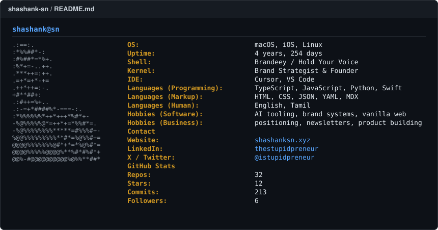

<picture>
  <source media="(prefers-color-scheme: dark)" srcset="assets/profile-neofetch.svg">
  
</picture>

---

### projects

| | project | what it is |
|---|---|---|
| | [**brandeey**](http://brandeey.com) | brand engine course, free tools, microcourses |
| | [**hold your voice**](http://holdyourvoice.com) | catch AI voice-flattening before it ships |
| | [**happy beginnings**](http://happybeginnings.in) | india's first digital wedding invite service |
| | [**sayabout.us**](http://sayabout.us) | testimonial collection platform |
| | [**two paise club**](http://twopaiseclub.com) | daily non-fiction book newsletter |
| | [**the stupidpreneur**](http://stupidpreneur.in) | daily newsletter archive |

 

  <a href="https://shashanksn.xyz"><b>website</b></a> &nbsp;·&nbsp;
  <a href="http://brandeey.com"><b>brandeey</b></a> &nbsp;·&nbsp;
  <a href="http://holdyourvoice.com"><b>hold your voice</b></a> &nbsp;·&nbsp;
  <a href="https://www.linkedin.com/in/thestupidpreneur/"><b>linkedin</b></a> &nbsp;·&nbsp;
  <a href="http://x.com/istupidpreneur"><b>x</b></a>

